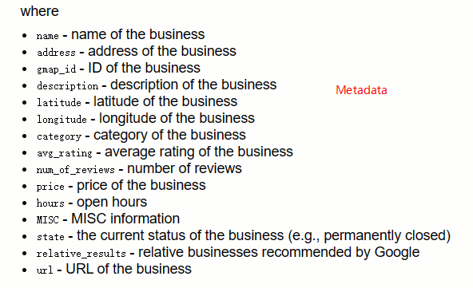

## 数据集详情
> This Dataset contains review information on Google map (ratings, text, images, etc.), business metadata (address, geographical info, descriptions, category information, price, open hours, and MISC info), and links (relative businesses) up to Sep 2021 in the United States.

交互记录有666,324,103条，用户有113,643,107位，POI数量有4,963,111个。

详情见官网[Google Local Data](https://jiachengli1995.github.io/google/index.html)

## 目标
对数据集[Google Local Data](https://jiachengli1995.github.io/google/index.html)进行预处理。通过获取POI的图片、评论、MISC等数据，并对这些数据进行处理，最终得到对POIs的总描述。

## 处理步骤
### 下载数据集
需要下载的是各个地区（如Hawaii）的交互数据（如 [review-Hawaii_10.json](https://datarepo.eng.ucsd.edu/mcauley_group/gdrive/googlelocal/review-Hawaii_10.json.gz)）和POI数据（如 [meta-Hawaii.json](https://datarepo.eng.ucsd.edu/mcauley_group/gdrive/googlelocal/meta-Hawaii.json.gz)），其中，每个文件都是json格式，每个json对象所包含的属性不一样，二者的属性如下图（from [Google Local Data](https://jiachengli1995.github.io/google/index.html)）。

  

### 第一步，获取POIs的图片集和评论总结
对`meta-xxx.json`文件解析（每一行对应一个POI），取出POI对应的url（如 [Google Map](https://www.google.com/maps/place//data=!4m2!3m1!1s0x7c006e76398089e5:0xa0e364b04ff91fd1?authuser=-1&hl=en&gl=us)），获取该POI的**图片集**（Photos）和**评论总结**（Review summary）。对应代码为 [get_imgs_and_review_summary_from_meta.py](./get_imgs_and_review_summary_from_meta.py)。

对于**图片集**，文件保存为：[gmap_1_0x7c00456eecad3111-0x8217f9600c51f33_2.png](./dataset/Hawaii/downloaded_multimodal_data/gmap_1_0x7c00456eecad3111-0x8217f9600c51f33_2.png)。其中，文件名使用字符串`_`分割，从前到后依次是：`gmap`表示一个固定字符串；`1`表示`meta-xxx.json`的第几行；`0x7c00456eecad3111-0x8217f9600c51f33`表示gmap_id，即POI的ID，但为了适配windows的文件系统，将gmap_id中的字符`:`替换为了字符`-`；`2`表示该POI对应图片集的第几张图片。

图片默认下载到`./dataset/xxx/downloaded_multimodal_data/xxxxx.png`。一般来说图片集进行处理之前需要更换图片路径，可以执行`mv ./dataset/xxx/downloaded_multimodal_data/*.png 'target_path'`。

对于**评论总结**，文件保存为：[review_summary.json](./dataset/Hawaii/downloaded_multimodal_data/review_summary.json)。文件的每一行是一个json对象，每个对象只有一对`key`和`value`。其中，`key`为POI的唯一标识，如`1_0x7c00456eecad3111-0x8217f9600c51f33`，同理，以字符`_`分割，`1`表示`meta-xxx.json`的第几行，`0x7c00456eecad3111-0x8217f9600c51f33`为gmap_id（替换后）；`value`为一个列表，保存评论总结信息，如`["Office clean and friendly staff.", ...]`。

评论总结默认下载到`./dataset/xxx/downloaded_multimodal_data/review_summary.json`。一般来说对评论总结进行处理之前需要更换路径，可执行`mv ./dataset/xxx/downloaded_multimodal_data/review_summary.json 'target_path'`。

### 第二步，提取汇总POIs的描述和评论
#### 获得POIs描述
对`meta-xxx.json`文件解析，取出POI对应的`description`和`MISC`，再将其转化成一段对该POI的描述的话。对应代码为 [get_poi_des_from_meta.py](./get_poi_des_from_meta.py)。

文件保存为 [pois_description.json](./dataset/Hawaii/pois_description.json)。文件的每一行是json对象，仅有一对`key`和`value`。`key`为POI唯一标识（如`1_0x7c00456eecad3111-0x8217f9600c51f33`），`value`为一个字符串，字符串中有多个句子（如`"The atmosphere here is Casual. ..."`）。

#### 汇总POIs评论
对`review-xxx_10.json`文件解析（每一行表示某用户和POI的交互记录），取出`text`（表示用户对此POI的评论），对某个POI的评论进行汇总（因为一个POI可能有多个用户到访过，且对其评论）。对应代码为 [get_review_from_review10json.py](./get_review_from_review10json.py)。

文件保存为 [pois_reviews.json](./dataset/Hawaii/pois_reviews.json)。文件的每一行是json对象，仅有一对`key`和`value`。`key`为POI唯一标识（如`0x7c00456eecad3111-0x8217f9600c51f33`，**PS：此处没有行号**），`value`为一个列表，列表中每个元素是一个用户对此POI的评论（如`["Great new upgrade.", ...]`）。

### 第三步，统一模态
到此为止，需要使用的数据已经收集完毕，分别是：POIs图片集，POIs的评论总结，POIs的描述，POIs的评论集。除了第一个外都是文字模特，需要将第一个的图像模态也转为文字模态。对应代码为 [blip2_as_transform_image_to_text.py](./blip2_as_transform_image_to_text.py)。

在此，使用的是预训练的模型 [Salesforce/blip2-opt-2.7b](https://huggingface.co/Salesforce/blip2-opt-2.7b)。

文件保存为 [image_description.json](./dataset/Hawaii/image_description.json)。文件的每一行是json对象，仅有一对`key`和`value`。`key`为POI唯一标识（如`1000_0x7954d1b588316389-0xdec81d0e39e5bbed`），`value`为一个列表，列表中每个元素是一张图片的转换结果（对图片的描述）（如`["a grassy field with a fence and a bench.", ...]`）。

### 最后，做嵌入
到此，四种数据都已是文字模态（分别是图片模态，评论模态，meta模态，review_summary模态），将四种数据（对应文件分别是 [image_description.json](./dataset/Hawaii/image_description.json)，[pois_reviews.json](./dataset/Hawaii/pois_reviews.json)，[pois_description.json](./dataset/Hawaii/pois_description.json)，[review_summary.json](./dataset/Hawaii/downloaded_multimodal_data/review_summary.json)）分别做嵌入。对应代码为 [flan_as_encoder_for_multimodal.py](./flan_as_encoder_for_multimodal.py)。

在此也是使用预训练的模型[declare-lab/flan-alpaca-xl](https://huggingface.co/declare-lab/flan-alpaca-xl)。

保存文件依次是：[modal_image_embedding.json](./dataset/Hawaii/modal_image_embedding.json)，[modal_review_embedding.json](./dataset/Hawaii/modal_review_embedding.json)，[modal_meta_embedding.json](./dataset/Hawaii/modal_meta_embedding.json)，[modal_review_summary_embedding.json](./dataset/Hawaii/modal_review_summary_embedding.json)。
